# Daniyal

### AI &amp; Automation Engineer · Islamabad, Pakistan

Most AI projects die between the demo and production. 
I work on the part that survives that gap.

---

## What I do

I build LLM systems end to end — retrieval, orchestration, and the automation
infrastructure that keeps them running. A prototype that answers well on ten
handpicked questions is not a product; the work is in what happens on the
ten thousand you didn't anticipate.

<table>
<tr>
<td width="50%" valign="top">

#### 🧠 LLM &amp; agent systems

Multi-agent architectures, tool-calling loops, and model orchestration.
Prompts treated as engineering artifacts — versioned, evaluated, and
regression-tested rather than tweaked by feel.

</td>
<td width="50%" valign="top">

#### 🔍 RAG pipelines

Chunking strategy, embeddings, vector search, reranking, and grounded
generation. Retrieval quality is where most RAG systems quietly fail,
so that is where most of the effort goes.

</td>
</tr>
<tr>
<td width="50%" valign="top">

#### 🔄 Workflow automation

n8n pipelines wiring APIs, webhooks, LLMs, and databases into processes
that run unattended — and fail loudly rather than silently.

</td>
<td width="50%" valign="top">

#### 🗄️ Data &amp; infrastructure

Postgres and Supabase schemas, FastAPI services, Dockerized deployments,
and Cloudflare edge delivery for everything above.

</td>
</tr>
</table>

---

## Selected work

#### [LLM-Resume-Analyzer](https://github.com/mdaniyal69/LLM-Resume-Analyzer) · `Python` · `LLM APIs`

Structured extraction and role-fit scoring over unstructured resumes. Parses
free-form documents into a normalised schema, then evaluates candidates against
role requirements — turning a stack of PDFs into comparable, queryable signal.

#### Forex signal engine · `Python` · `MCP` · `PostgreSQL` private

Live OANDA market feed feeding a multi-strategy confluence scorer. Strategies
vote independently and their agreement is scored, rather than trusting any single
indicator. Exposed to AI agents through a Model Context Protocol server, so an
agent can query live market structure as a tool.

#### Proposal generation engine · `JavaScript` · `LLM APIs` private

Analyses job postings, extracts requirements, and drafts tailored proposals
grounded in a profile of real past work — cutting a repetitive writing task to
a review-and-send step.

#### n8n automation pipelines · `n8n` · `PostgreSQL` · `Webhooks` private

Production workflow automations connecting APIs, LLMs, webhooks, and databases,
with versioned workflow backups so a broken node is a rollback rather than a
rebuild.

Several projects are private — client work, or in cleanup for public release.
Happy to walk through architecture and tradeoffs on request.

---

## Toolkit

**AI &amp; LLM**  

**Automation &amp; backend**  

**Data &amp; cloud**  

---

## How I think about this work

**Retrieval beats prompting.** A sharper prompt on the wrong context is wasted
effort. Fix what the model sees first.

**Evaluate, then iterate.** Without a measurement you are not improving a system,
you are redecorating it.

**Fail loudly.** An automation that breaks silently is worse than one that never
ran — you keep trusting output that stopped being true.

**Ship the boring plumbing.** Retries, schema validation, and backups are what
separate a demo from something people depend on.

---

## Currently

- Building agentic systems that chain LLMs, tools, and live data sources
- Going deep on retrieval quality — the part of RAG most people skip
- Exploring knowledge graphs as structured memory for agents
- Working on trading infrastructure and market data pipelines

---

**Open to collaborating on AI automation and LLM product work.**

<a href="https://aideon.pages.dev/">aideon.pages.dev</a>

